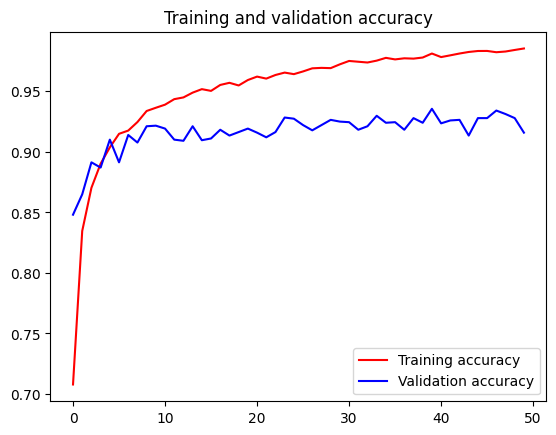

<p align="center">
  <h1 align="center"><b>Signnary Machine Learning</b></h1>
</p>

# **Table of Contents**

1. [Replication Steps](#replication-steps)
2. [InceptionV3](#xception-model)
3. [Result](#result)
4. [References](#references)

## **Replication Steps**

To replicate the project:

1. **Download the dataset and model:** [Google Drive Link](https://drive.google.com/drive/folders/1K4rDIEgUuPtyv4ChDCTJVHQ4Mz463XK_?usp=sharing)

2. **Mount Google Drive in Colab:**

```python
from google.colab import drive
drive.mount('/content/drive')
```

3. **Run the notebook:** Execute all cells in the provided notebook file.


1. **The Basics: Image Processing**

Signnary starts with image processing. When you capture a photo or upload an image of a sign language gesture, the app scans and analyzes it to identify the gesture. Think of it like having a special camera that can understand hand movements and shapes.

2. **Advanced Image Processing with CNNs**

* **Image Capture and Upload:** Users can either take a picture using their device's camera or upload an existing image.


* **Feature Extraction with CNNs: ** CNNs scan the image using multiple filters to detect important features like edges, textures, and shapes. It’s like examining a picture through various lenses to identify significant details.
* 
* **Transfer Learning with InceptionV3: ** InceptionV3 is a deep learning model pre-trained on a large dataset (ImageNet) to recognize a wide variety of images. This pre-training allows it to learn general features that can be applied to new tasks.


4. **Features**

* **Translation:** The app quickly translates sign language gestures into text, enabling smooth and immediate communication.
  
* **Comprehensive Dictionary:** Signnary includes a built-in dictionary of BISINDO sign language, offering users a reference tool to learn and verify gestures. This dictionary helps users understand and practice sign language more effectively.

5. **Why It is Cool?**
Signnary’s real power lies in its ability to make communication accessible and efficient. By using advanced image processing, CNNs, and transfer learning with InceptionV3, and providing a comprehensive sign language dictionary, it bridges the communication gap for people with disabilities. Imagine having a tool that not only understands sign language gestures instantly but also helps you learn and improve your signing s

6. **Final Thoughts**

Signnary is like a smart interpreter for sign language, turning complex gestures into readable text quickly and accurately. It simplifies communication for people with disabilities, making conversations smoother and more accessible. In essence, Signnary combines the power of advanced technology, including CNNs and InceptionV3, with the practicality of a user-friendly app to enhance communication and understanding in everyday interactions.


## Result



The plot of our InceptionV3 model's training history reveals promising performance, with training accuracy stabilizing around 95% and validation accuracy at 90%-91%. While there is a slight gap indicating some overfitting, the model shows good generalization on unseen data. This suggests a robust model but leaves room for further tuning to close the gap.

Overall, the model shows strong performance with the BISINDO Sign languange predictions, and slightly confidence based on the image uploaded

## References

* TensorFlow Documentation: https://www.tensorflow.org/

* Keras API Reference: https://keras.io/
